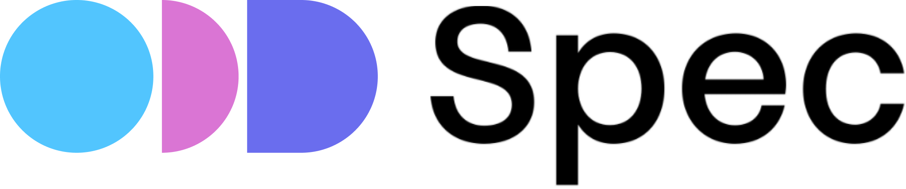
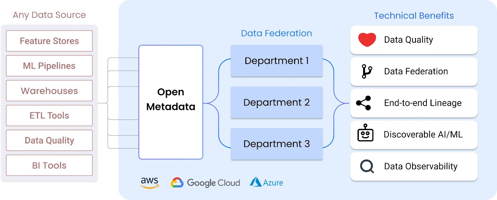

&nbsp;

 

 

# Open Data Discovery Specification (ODD Spec): A Universal Standard for Metadata Collection 

 

## Specification

* :point_right:  [`specification.md`](./specification/specification.md) is a versioned description of the current Open Dat aDiscovery Standard. 
* :point_right:  Here is a reference implementation of Open Data Discovery Specification: [Open Data Platform](https://github.com/opendatadiscovery/odd-platform) (ODD Platform).

 

## Overview

ODD Spec is an open source industry-wide standard for collecting metadata. It provides a set of technologies to gather and export metadata from cloud-native applications, infrastructure, and other data sourcces to let it be discovered. The standard defines a schema for metadata collection and integrates with data tools through endpoints to receive metadata from them. 

Data catalogs built on ODD Spec would enjoy important opportunities like data federation, real end-to-end lineage, data quality assurance, company-wide observability, and discoverable ML assets.   

&nbsp;

 

## Contributing

Contributing to ODD Spec is very welcome. For basic contributions, all you need is being comfortable with GitHub and Git. The best ways to contribute are: 
* Work on new adapters 
* Work on documentation

To ensure equal and positive communication, we adhere to our [Code of Conduct](./CODE_OF_CONDUCT.md). Before starting any interactions with this repository, please read it and make sure to follow. 

Please before contributing check out our [Contributing Guide](./CONTRIBUTING.md) and issues labeled "good first issue": 

 

## License

ODD Spec uses the [Apache 2.0 License](https://www.apache.org/licenses/LICENSE-2.0.txt).
