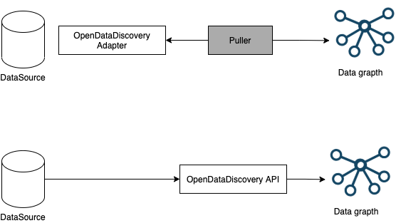

# Specification

Version: Draft

## OpenDataDiscovery scope

OpenDataDiscovery specification is intentionally agnostic about the specifics of particular data sources and data catalogs. It exists to describe the semantics of data discovery process.

## Discovery process

Metadata discovery process is very simular to metrics/logs/traces gathering process. We might have pull or push model. Both of them are appropriate for specific use cases.


### Pull model

Pulling metadata directly from the source seems is the most straightforward way to gather metadata, but it may become a nightmare to develope and maintain a centralized fleet of domain-specific crawlers. OpenDataDiscovery introduces new entity: OpenDataDiscovery Adapater. The main goal of these adapaters are to be source specific and expose only information could be gathered from certain data source.



Preferred if:

* Latency on index update is ok
* There is already an adpater

### Push model

It supports for individual metadata providers to push the information in the central repository via APIs.
This could be more prefered way for certain use cases. For example Airflow jobs runs and quality check runs.


Preferred if:

* Near-realtime index is important
* There is no implemented adpater
* Information could be gathered only during job time

## DataModel

Knowledge about data is spread amongst many people and systems. OpenDataDiscovery role is to provide a standard protoocol how metadata can be collected and correlated in as automated fashion as possible.
To enable many different datasources and tools to expose the metadata we need agreement on what data should be exposed and in what format (structures).
Specification contains of high level entities  DataInputs, DataTransformers, DataSets and DataConsumers.
Each entity has a unique url describing a place, system and an identifier in this system.

###  DataInputs

Is a source of your data, it could be described as a web site url, external s3 bucket or real life data place.
```yaml
DataInput:
    properties:
        oddrn:
            example: //http/www.amazon.com/goods
            type: string
        name:
            type: string
        owner:
            example: //aws/iam/{account_id}/user/name
            type: string
        description:
            type: string
    required:
        - description
```

### DataSets

DataSet is a collectin of data stored in structured, semi-structued or unstructured format.
It might be a table in relational database, parquet file on s3 bucket, hive catalog table and so on.
DataSets could have subdatasets. For example Hive table is a dataset itself and it consists of DataSets as a folders/files on HDFS/S3.

```yaml
DataSet:
    type: object
    properties:
        oddrn:
          example: //aws/glue/{account_id}/{database}/{tablename}
          type: string
        name:
          type: string
        owner:
          example: //aws/iam/{account_id}/user/name
          type: string
        parentOddrn:
            type: string
            example: //aws/glue/{account_id}/{database}/{tablename}
        description:
            type: string
        updatedAt:
            format: date-time
            type: string
        subtype:
            enum:
                - DATASET_TABLE
                - DATASET_FILE
                - DATASET_FEATURE_GROUP
            type: string
        fieldList:
            items:
            $ref: '#/components/schemas/DataSetField'
            type: array
    required:
        - description

DataSetField:
    type: object
    properties:
        type:
            $ref: '#/components/schemas/DataSetFieldType'
        defaultValue:
            type: string
        description:
            type: string
        required:
        - type

DataSetFieldType:
    type: object
    properties:
        name:
            type: string
        type:
            type: string
        logicalType:
            type: string
        isNullable:
            type: boolean
        isList:
            type: boolean
        isMap:
            type: boolean
        required:
        - type
        - isNullable
        - isMap
        - isList

```

#### Tables

Example oddrn
```//postgresql/{host}/{database}/{schema}/{tablename}```

#### Files

Example url:
```//aws/s3/{bucket}/{path}```

#### FeatureGroups

Example url:

```//feast/host/{namespace}/{featuregroup}```

###  DataTransformers

```yaml
    DataTransformer:
        type: object
        properties:
            oddrn:
                example: //aws/glue/{account_id}/{database}/{tablename}
                type: string
            name:
                type: string
            owner:
                example: //aws/iam/{account_id}/user/name
                type: string
            description:
                type: string
            sourceCodeUrl:
                type: string
            sql:
                type: string                        
            inputs:
                type: array
                items:
                type: string            
            outputs:
                type: array
                items:
                type: string
            subtype:
                type: string
                enum: 
                - DATATRANSFORMER_JOB
                - DATATRANSFORMER_EXPERIMENT
                - DATATRANSFORMER_ML_MODEL_TRAINING
        required:
        - description
        - inputs
        - outputs
        - subtype
```

#### ETL jobs

Example url: //airflow/{host}/{path}/{dag_id}/{job_id}  

#### ML Training jobs

Example url: kubeflow://{host}/{path}/{job_id}

### DataConsumers

```yaml
    DataConsumer:
        type: object
        properties:
            description:
                type: string
            inputs:
                type: array
                items: 
                    type: string
            subtype:
                type: string
                enum: 
                - DATACONSUMER_DASHBOARD
                - DATACONSUMER_ML_MODEL               
          required:
            - description

```

#### ML Models

Example url: ```//aws/sagemaker/{account_id}/{model_id}```

#### BI dashboards

Example url: ```//tableu/{host}/{path}/{dashboard_id}```

### DataSetQualityTests

```yaml
    DataQualityTest:
        type: object
        properties:
            description:
                type: string
            datasetList:
                type: array
                items:
                    type: string
            suiteUrl:
                type: string
            linkedUrlList:
                type: array
                items:
                    $ref: '#/components/schemas/LinkedUrl'
        required:
            - description
            - datasetList

    DataQualityTestRun:  
        type: object
        properties:
            dataQualityTestOddrn:
              type: string
            startTime:
              type: string
              format: date-time
            endTime:        
              type: string
              format: date-time
            statusReason:
              type: string
            status:
              type: string
              enum:
                - SUCCESS
                - FAIL
                - ABORTED
                - OTHER
        required:
            - dataQualityTestOddrn
            - startTime
            - endTime
            - status

```

